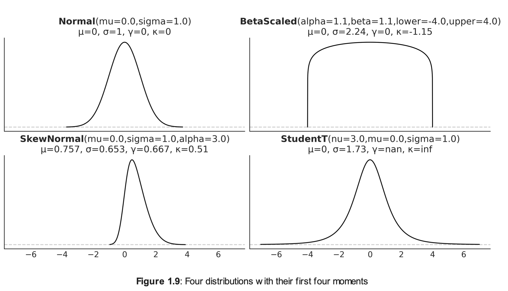
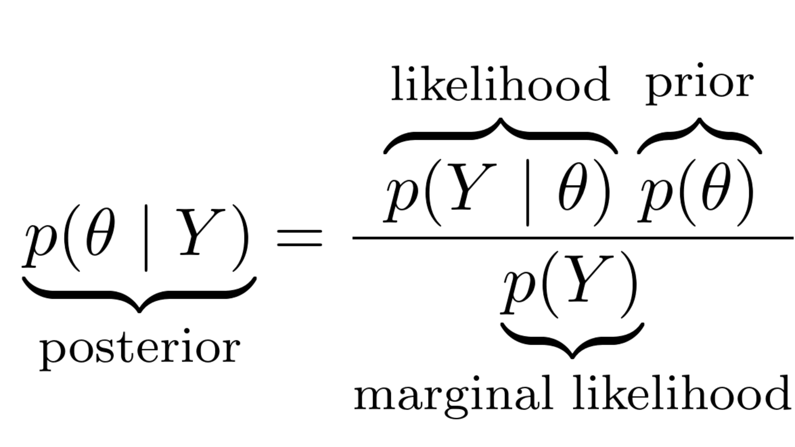

# Glossary

### PDF = Probability Density Function
A Probability Density Function describes the probability distribution of a 
**continuous** random variable

### PMF = Probability Mass Function
A Probability Mass Function describes the probability distribution of a 
**discrete** random variable

### CDF = Cumulative Distribution Function
A Cumulative Distribution Function describes the probability that a random 
variable is less than or equal to a certain value. 

### Moments = Variance, Standard Deviation, Skewness, Kurtosis

### Variance
It is also called "spread" of the distribution. It tells us how much the values in the 
distribution deviate from the mean

### Standard Deviation 
It is the square root of the variance. 

### Skewness

It tells us how much the distribution is skewed to the left or to the right. 

### Kurtosis
It tells us how much the distribution is peaked. 

### Prior, posterior, likelihood, marginal likelihood 

The **prior** should reflect what we know about the distribution before seeing any data. It can be a flat prior, 
but in most cases it's recommended to choose a better alternative. 

The **likelihood** is an expression of the plausibility of the data given the parameters

The **posterior** is the result of our analysis. It is not a value, but a distribution of values and it is conditioned 
both by the prior and the likelihood. 

For the **marginal likelihood** it's important to note that it acts as a scaling factor that ensures our posterior will 
have a proper Probability Density Function (PDF).

# Notions
A PDF doesn't have value in one point. It is nonsensical to ask what is the value
of a pdf in a given point x, instead we compute an integral of the PDF over an interval 
and that allows us to know what's the probability that the random variable lands somewhere in that range. 

Stopped at "1.4.7 Expected values"